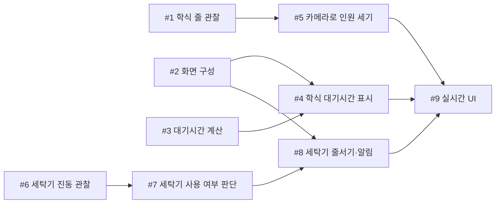

# 5주차 활동지 / Week 5 Worksheet

**1-page 기획서 / One-page plan**

- 작성일 / Date: 2026-09-30
- 참여자 / Present: 박지성, 박재원, 전시준, 강태혁

---

## ① 주제 확정 / Confirm topic

- 확정 주제 / Topic: ERICA 캠퍼스 대기 현황 웹앱. 학식과 세탁실에 가기 전에 지금 얼마나 기다려야 하는지 휴대폰으로 확인할 수 있게 한다.
- 이유 / Reason: 3주차 문제 정의에서 학식 줄을 보고 돌아서거나, 세탁실에 내려갔다가 빈 세탁기가 없어 다시 올라오는 헛걸음이 자주 있다는 것을 확인했다. 가기 전에 상황을 알 수 있으면 이런 헛걸음을 줄일 수 있다.

---

## ② 태스크 분해와 의존 관계 / Tasks and dependencies

### 태스크 목록 / Task list

4주차 사용자 스토리와 완료 조건을 태스크로 나눕니다.
*Break down your Week 4 user stories and acceptance criteria into tasks.*

각 태스크는 따로 끝내도 맞는지 확인할 수 있어야 합니다. 담당에 '다 같이'는 쓰지 않습니다.
*Each task must be checkable on its own. Do not write "everyone" as owner.*

| # | 태스크 Task | 완료 조건 Done when | 선행 태스크 Depends on | 담당 Owner |
|---|---|---|---|---|
| 1 | 학식 줄 관찰 | 점심시간에 줄 인원과 배식 속도를 직접 세어 며칠 치 기록표를 만듦 | 없음 | 팀원 A |
| 2 | 화면 구성 정하기 | 메인, 학식, 세탁실 화면 스케치를 팀원 모두가 보고 합의함 | 없음 | 팀원 C |
| 3 | 대기시간 계산 | 줄 인원과 처리 속도를 넣으면 손으로 계산한 값과 같은 대기시간이 나옴 | 없음 | 팀원 B |
| 4 | 학식 화면에 대기시간 표시 | 휴대폰으로 학식 화면을 열면 예상 대기시간이 보임 | 2, 3 | 팀원 C |
| 5 | 카메라로 줄 인원 세기 | 촬영한 영상에서 센 인원이 1번에서 사람이 센 인원과 크게 다르지 않고, 영상은 저장하지 않음 | 1 | 팀원 D |
| 6 | 세탁기 진동 관찰 | 세탁기가 돌 때와 멈췄을 때의 진동 차이를 확인하고 기록함 | 없음 | 팀원 A |
| 7 | 세탁기 사용 여부 판단 | 진동으로 "사용 중"과 "비어 있음"을 구분해 화면에 보여 줌 | 6 | 팀원 D |
| 8 | 세탁기 줄서기와 알림 | 앱에서 줄을 서 두면 세탁기가 비었을 때 내 차례 알림이 옴 | 2, 7 | 팀원 B |
| 9 | 실시간 UI | 시연 중 송신 핸드폰에서 온 데이터를 기반으로 실시간 UI 구성 | 4, 5, 8 | 팀원 B |

### 의존 관계 그래프 / Dependency graph (DAG)

화살표는 "앞 태스크가 끝나야 뒤 태스크를 할 수 있다"는 뜻입니다.
*An arrow means the first task must finish before the second can start.*

- 지금 착수 가능 (진입 차수 0) / Can start now (in-degree 0): #1, #2, #3, #6
- 작업 순서 (위상정렬) / Work order (topological sort): #1 → #2 → #3 → #6 → #4 → #5 → #7 → #8 → #9
- 사이클이 있었다면 어떻게 풀었는가 / If there was a cycle, how did you fix it?: 없음

---

## ③ 범위 결정 / Scope

### Must — 없으면 성립 안 됨 / essential

핵심 시나리오 1개가 끝까지 동작하는 데 필요한 것만 / *Only what the core scenario needs to work end-to-end*

- 핵심 시나리오 / Core scenario: 사용자인 학생이 대기열이 존재하는 공용실 혹은 공용 물품(기숙사 세탁기, 건조기, 오픈스페이스, 셔틀버스 대기줄 등)의 현재 상황(줄 인원, 처리 속도)을 바탕으로 계산한 예상 대기시간을 실시간 UI를 통해 확인한다.
  
### Should

- 시나리오: 학생이 세탁실에 내려가기 전에 빈 세탁기가 있는지 확인하고, 없으면 앱에서 줄을 서 둔 뒤 세탁기가 비면 알림을 받는다.

### Could

- 시나리오: 셔틀 정류장 줄을 보고 이번 버스를 탈 수 있을지 알려 준다.

### **Won't — 이번 학기에 안 함 / not this semester**

| Won't 항목 Item | 포기한 이유 Why |
|---|---|
| 학교 CCTV 연동 | 학교 허가와 개인정보 문제가 있어 한 학기 안에 어렵다. 직접 촬영한 영상으로 대신한다 |
| 학번 로그인과 세탁기 예약 | 학번 같은 개인정보를 받고 싶지 않고, 앱을 안 쓰는 학생이 먼저 오프라인으로 오면 예약이 지켜지지 않는다 |

### 실행 가능성 확인 / Feasibility check

- 특수 장비·유료 API·실제 개인정보가 필요한가? 필요하다면 대안은?
  *Does it need special hardware, paid APIs or real personal data? If so, what is the alternative?*

  세탁기 진동을 재려면 저렴한 진동 센서가 필요하다. 준비가 어려우면 가짜 데이터로 대신한다. 카메라는 노트북 웹캠이나 직접 찍은 영상을 쓰고, 영상은 저장하지 않고 인원 숫자만 쓴다. 유료 API는 쓰지 않고, 학번이나 이름은 받지 않는다.

- 15주차에 발표장에서 시연할 수 있는 형태인가?
  *Can it be demonstrated live in Week 15?*

  노트북과 휴대폰만 있으면 시연할 수 있다. 노트북에서 영상을 틀어 학식 대기시간이 바뀌는 것을 보여 주고, 세탁기는 가짜 데이터로 줄서기와 알림을 보여 준다.

---

## ④ 가장 먼저 동작시킬 흐름 (Walking Skeleton) / First end-to-end flow

예 / Example: 과제 ID를 입력하면 → LMS에서 제출 기록을 받아 와서 → 화면에 제출 인원 숫자 하나가 뜬다

> [무엇을 입력하면] → [무엇을 처리해서] → [화면에 무엇이 나온다]
> 학식 줄 인원과 처리 속도를 직접 입력하면 → 인원을 처리 속도로 나눠 대기시간을 계산해서 → 휴대폰 학식 화면에 "약 몇 분"이 뜬다

---

> 수업 종료 시 커밋하세요 / Commit this at the end of class
> `git add docs/week-05.md && git commit -m "docs: 5주차 활동지 작성"`
